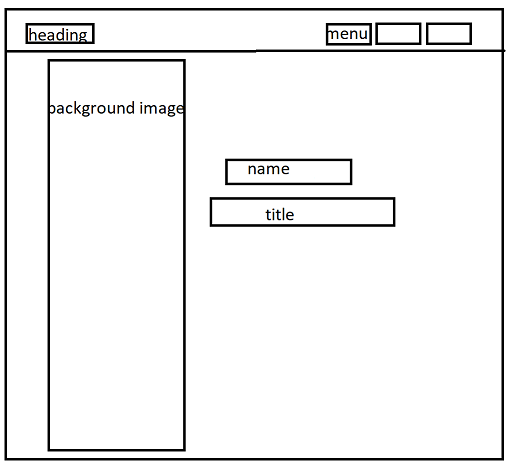

# Project-00
In this project i have created a my personal website 
## Techonologies i have used :
```
    Html5
    css
    jQuery
    javascript

```

## Process/Approach :
Before starting coding i made all wireframe of the design and after that I started  codeing for bigger screen size, above 1100px at max, continuing along with the small size.

I used mozilla, web developer > responsive desing mode,  tool to check the effect on website depending to changes in screen width. wherever any undesired changes occured in the webiste i used another css rules
for that particular screen size. For instance
```
@media (max-width: 756px) {
    //
    //
 }
```

## Unsolved probles :
whenever the child elements position has an absolute value it's parent element gets collapsed.
I was unable to figure out any alternatives to this situation.

## Challenges and Solution :
the challenging part for me was to move the texts in a particular path to give an animative effect. To solve this challenge i made a new javascript library which moves the texts in difined beizer curve. I will soon be publishing my library in github.
```
//beizerText object initialization

var nme = new beizerText({
    parent          :'mh',
    text            :'Ujwal Rai',
    control_points  : [[350,350],[650,450],[550,300],[400,300],[400,200],[600,200],[600,100],[0,0]],
    end_text_align  :'',
    final_font      :55,
    charDelay:100,
    aniDelay :10
    });
    
```
